# *Stroly*の使い方

## index
### アプリ本体について
- [*Stroly*の使い方](#strolyの使い方)
  - [index](#index)
    - [アプリ本体について](#アプリ本体について)
    - [開発環境](#開発環境)
- [アプリ本体の使い方](#アプリ本体の使い方)
  - [ユーザー登録・ログイン](#ユーザー登録ログイン)
  - [写真の投稿](#写真の投稿)
  - [マップ](#マップ)
    - [マップの見方](#マップの見方)
      - [切り替え表示](#切り替え表示)
    - [ピン](#ピン)
      - [ハテナピン](#ハテナピン)
      - [まとまったピン](#まとまったピン)
      - [季節・時間ごとの表示](#季節時間ごとの表示)
  - [タイムライン](#タイムライン)
  - [ユーザープロフィール](#ユーザープロフィール)
    - [自分の投稿を閲覧する](#自分の投稿を閲覧する)
    - [アイコンを変える](#アイコンを変える)
    - [設定画面](#設定画面)
    - [フレンド登録](#フレンド登録)
  - [フレンド](#フレンド)
    - [フレンド一覧](#フレンド一覧)
    - [フレンドプロフィール](#フレンドプロフィール)
- [開発環境](#開発環境-1)
  - [Xcode](#xcode)
  - [サーバー](#サーバー)
  - [初期設定](#初期設定)
    - [VoltaとNode.jsのインストール](#voltaとnodejsのインストール)
    - [pnpmのインストール](#pnpmのインストール)
- [開発方法](#開発方法)

### 開発環境
- [Xcode](#xcode)
- [サーバー](#サーバー)

--- 
# アプリ本体の使い方

## ユーザー登録・ログイン
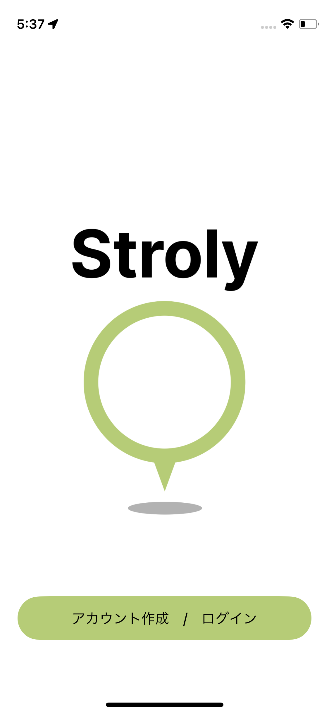

起動時には、上記のような画面が表示されます。

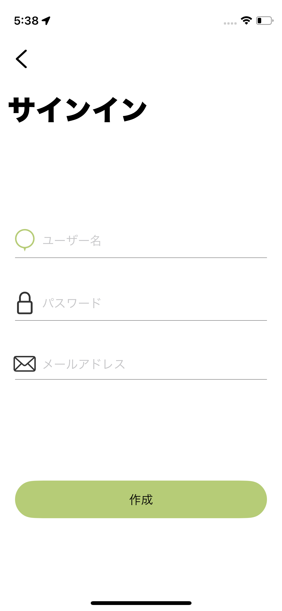

ユーザー登録には、ユーザー名、メールアドレス、パスワードが必要です。  
ユーザー名は、他のユーザーと同じ名前を使っても構いません。  
メールアドレスで一意性が保たれます。

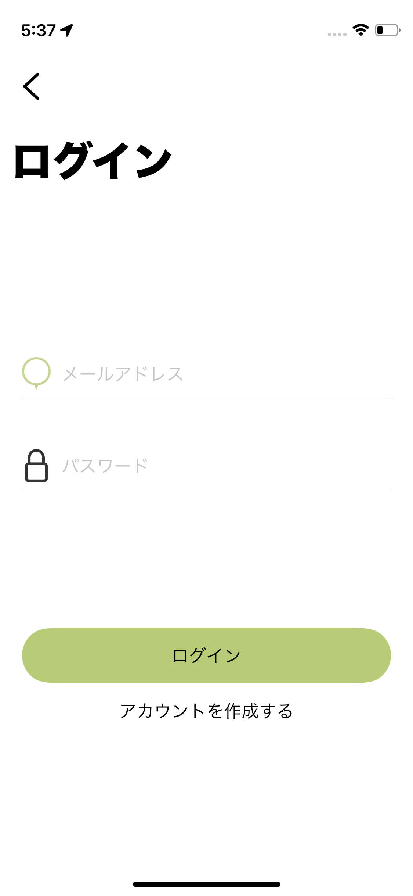

ログインには、メールアドレスとパスワードが必要です。

## 写真の投稿
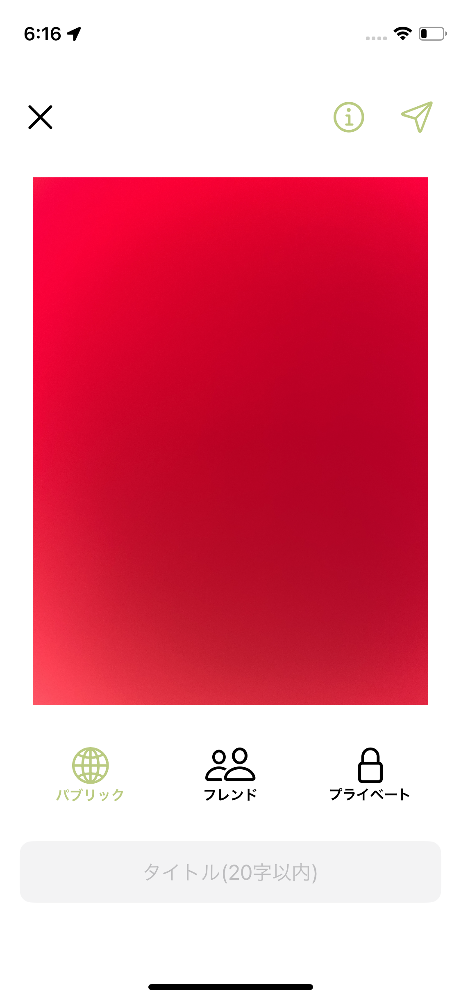

下部にあるカメラのアイコンをタップすると、写真を撮影することができます。  
写真を撮影した後、上記のような画面が表示されます。ここでは、写真のタイトルと公開範囲を設定することができます。  
公開範囲は、`パブリック`、`フレンド`、`プライベート`の3つから選ぶことができます。  
それぞれ、全ユーザーに公開(フレンド以外に？ピンで表示)、フレンドにのみ公開、自分のみに公開となります。

## マップ


### マップの見方
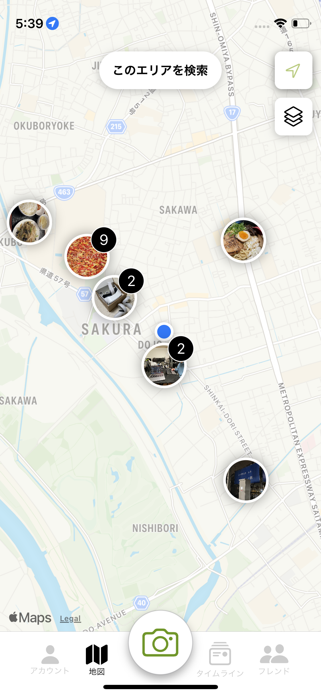

タブでマップを押すと、上記のような画面が表示されます。  
マップには、ピンが表示されています。ピンをタップすると、その場所で投稿された写真を閲覧することができます。  
スクロールやピンチイン・アウトで、マップを拡大・縮小することができます。また、それに伴って、地図範囲内のピンも自動的に取得されます。  
ピンの取得で不具合があれば、```このエリアを検索```をタップすることで、再取得することができます。

#### 切り替え表示
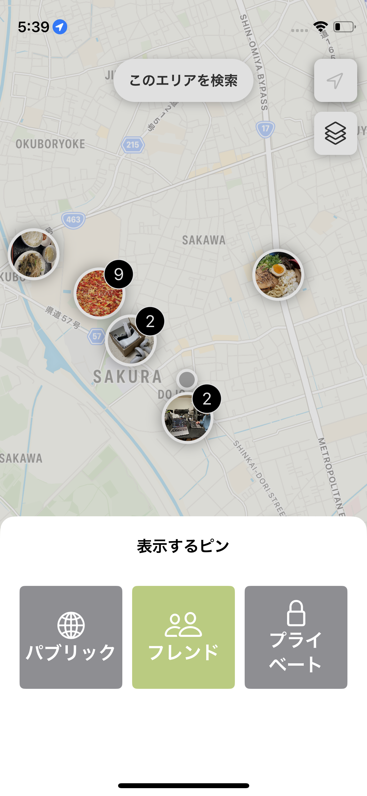

マップの右上の２番目にあるアイコンをタップすると、上記のような画面が表示されます。それぞれ、`パブリック`、`フレンド`、`プライベート`の3つから選ぶことができます。  
パブリックの場合、自分とフレンド以外のユーザーが投稿した写真が表示されます。フレンドの場合、フレンドが投稿した写真が表示されます。プライベートの場合、自分が投稿した写真が表示されます。  
これらは同時に選択することができます。


### ピン

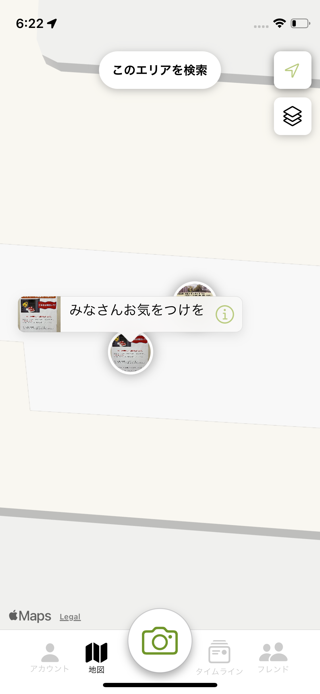
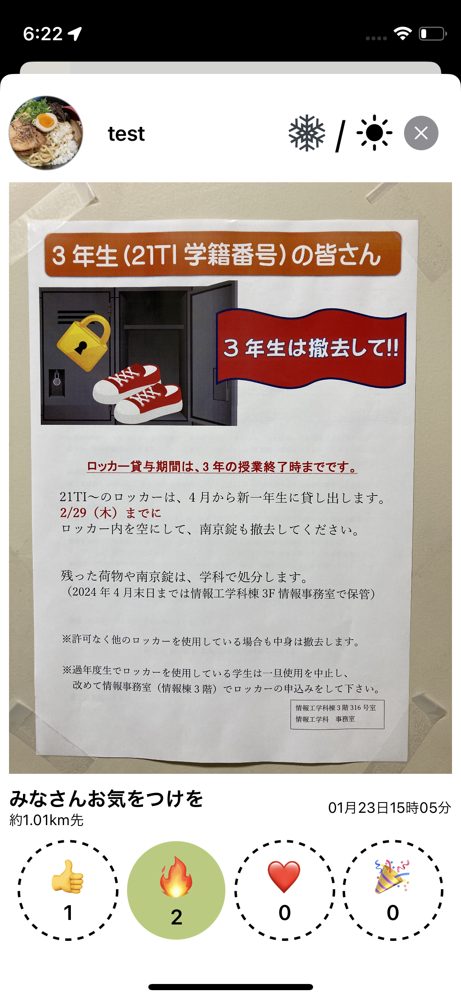

一つのピンは、一つの写真を示しています。  
ピンをタップすると、その場所で投稿された写真を閲覧することができます。  
２枚目の画像のように、下部には、スタンプアイコンが表示されており、１ユーザーにつき１つのスタンプを押すことができます。

#### ハテナピン
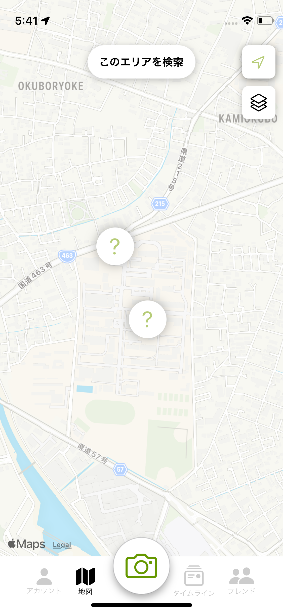

ピンの中には、`？`が表示されることがあります。  
これは、自分とフレンド以外のユーザーが投稿した写真があることを示しています。  
？ピンの半径400m以内に行くと、？が解放され、その場所で投稿された写真を閲覧することができます。

#### まとまったピン
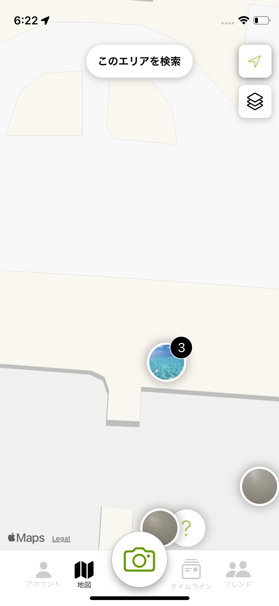

ピンが多くなると、まとまったピンが表示されます。

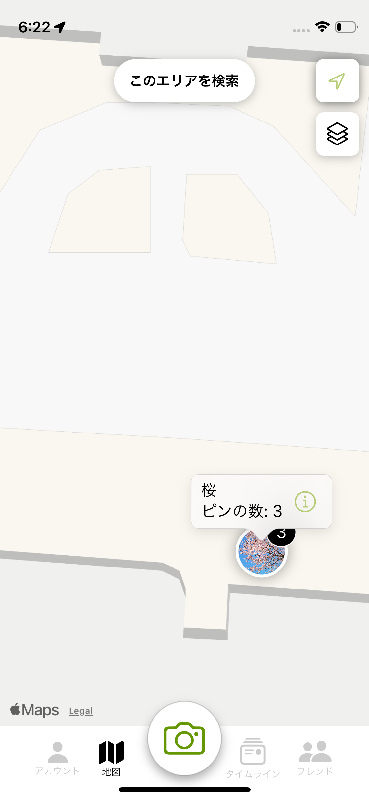

まとまったピンをタップすると、上記のような画面が表示されます。

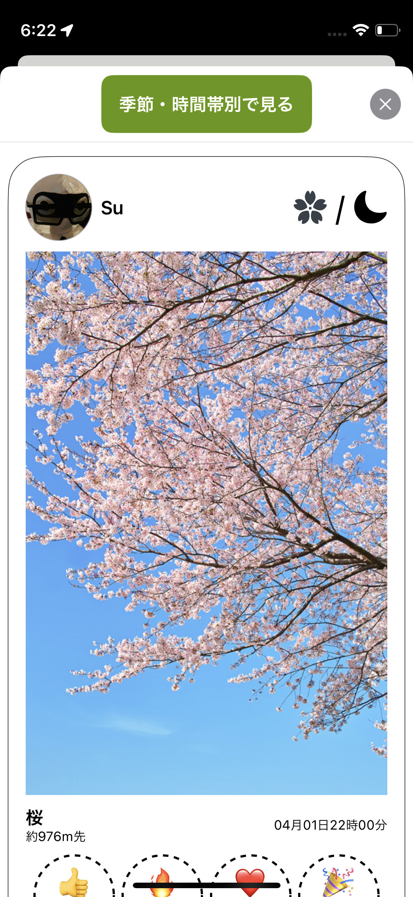

さらに、ピンをタップすると、その場所で投稿された写真を一覧で閲覧することができます。

#### 季節・時間ごとの表示
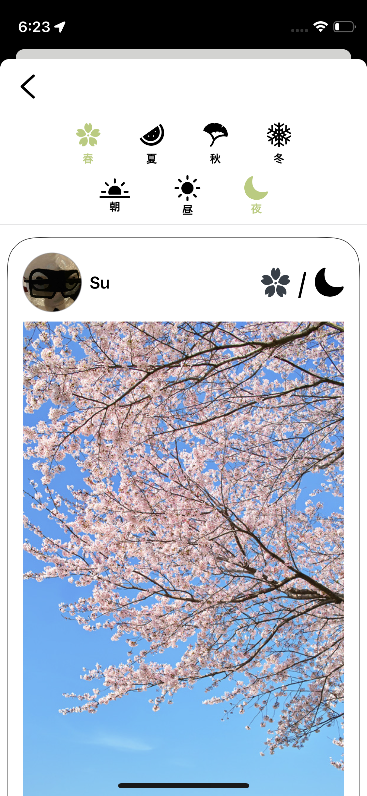
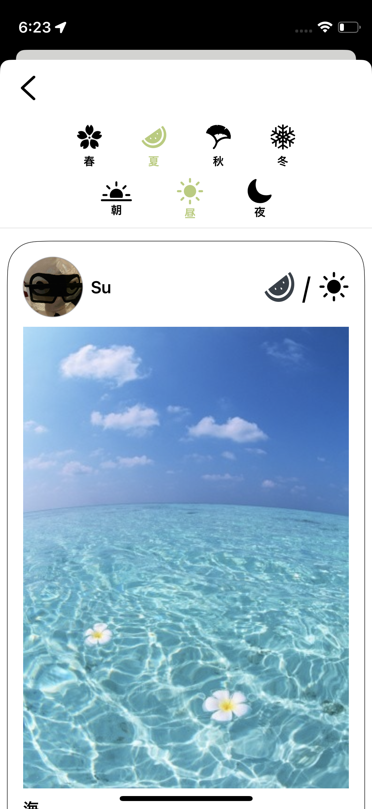
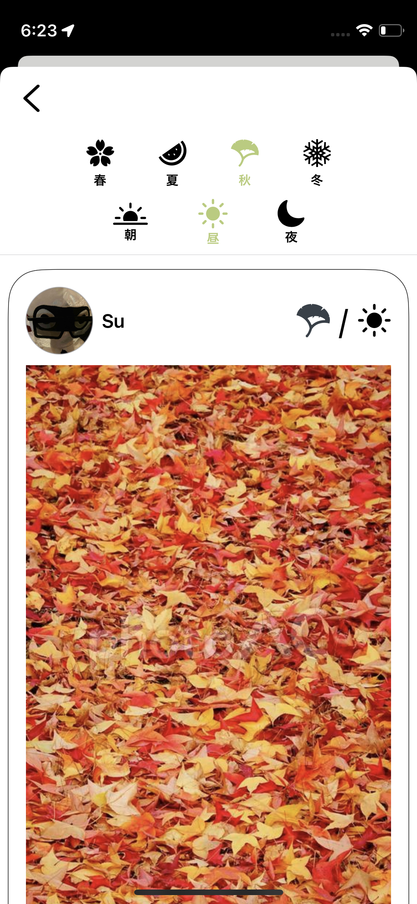

上記のように、まとまったピンからは、季節、時間帯ごとの表示を選ぶことができます。


## タイムライン

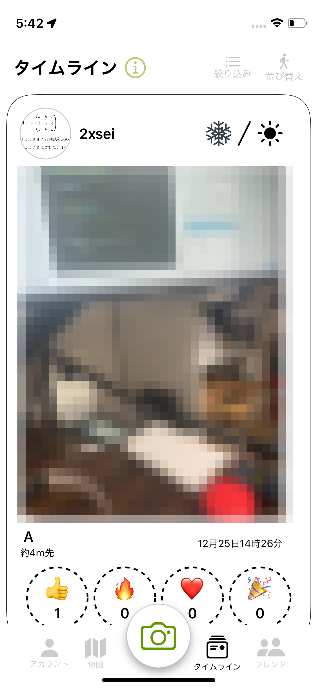

タブでタイムラインを押すと、上記のような画面が表示されます。
タイムラインは、現在地の半径400m以内で投稿された写真が表示されます。
これは、パブリック、フレンド、プライベートすべての写真が表示されます。

## ユーザープロフィール

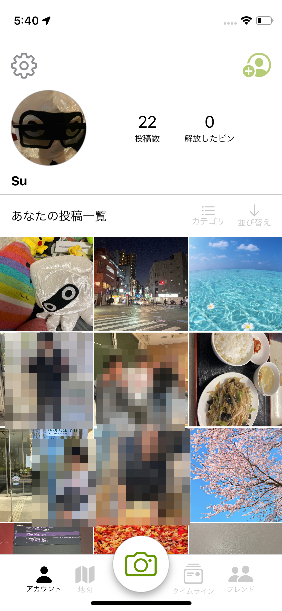

タブでプロフィールを押すと、上記のような画面が表示されます。
ユーザープロフィールでは、投稿数、解放した？ピンの数、アイコン、ユーザー名、自分の投稿を閲覧することができます。

### 自分の投稿を閲覧する

自分の投稿は、プロフィール画面の下部に表示されます。 
写真の上にあるボタンから季節、時間帯、公開範囲ごとに表示を切り替えることができます。

### アイコンを変える

プロフィールのアイコンをタップすると、アイコンを変更することができます。
アイコンは、カメラロールから選ぶことができます。

### 設定画面

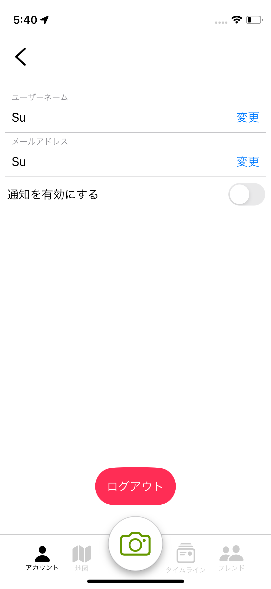

プロフィール画面の右上のアイコンをタップすると、設定画面に移動することができます。  
ログアウトもここから行うことができます。

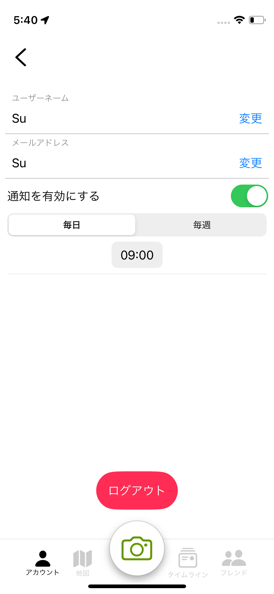
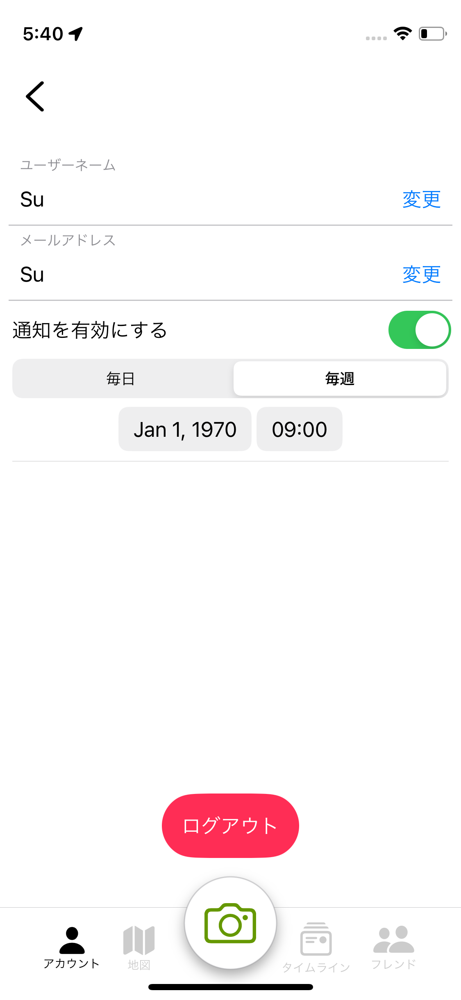

設定画面では、通知の設定を変更することができます。

### フレンド登録


プロフィール画面の右上のアイコンをタップすると、フレンド登録することができます。  
最初上記のようにQRコードが表示されます。QRコードの下には、他のユーザーのQRコードを読み取るためのボタンが表示されます。  
お互いにQRコードを読み取ることで、フレンド登録することができます。

## フレンド

### フレンド一覧
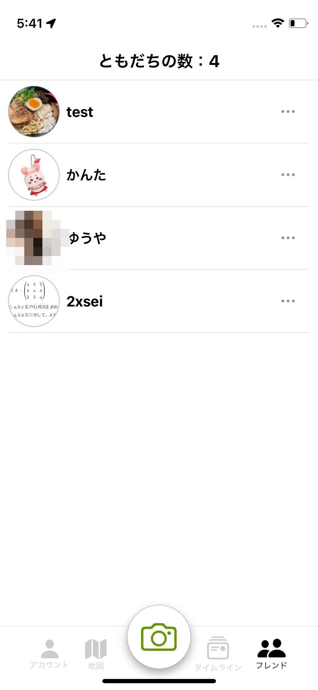

タブでフレンドを押すと、上記のような画面が表示されます。
フレンド一覧は、フレンド登録したユーザーが表示されます。

### フレンドプロフィール

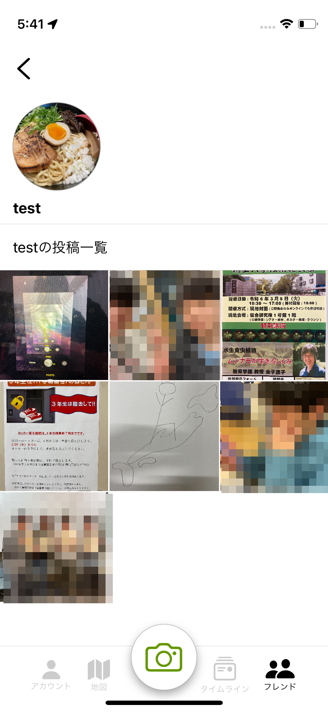

フレンド一覧から、フレンドのアイコンをタップすると、上記のような画面が表示されます。  
フレンドの投稿を閲覧することができます。


# 開発環境

## Xcode

このアプリは、Xcode 15.0以上で開発されています。  
また、iOS 17.0以上で動作します。ご注意ください。  
プロジェクトファイルの場所は、`Product/stroly/`配下にあります。
基本的には、そのままでもビルドできるようになっていますが、サーバーからデータを取得するためのURIは各自で書き換える必要があります。

## サーバー

## 初期設定
Node.jsとpnpmをインストールしてください。


### VoltaとNode.jsのインストール
Node.jsをインストールするために、今回はVoltaというツールを使います。これは、Node.jsのバージョン管理ツールです。

```bash
curl https://get.volta.sh | bash
```
このコマンドを実行すると、Voltaが自動的にインストールされます。

Node.js v18.0.0をインストールするために、以下のコマンドを実行してください。

```bash
volta install node@18.19.0
```

### pnpmのインストール
pnpmは、Node.jsのパッケージ管理ツールです。

```bash
npm install -g pnpm
```


# 開発方法
``Product/backend/``配下に、サーバーを構成するファイルがあります。
まずは、そのディレクトリに移動してください。
```bash
cd Product/backend/
```

次に、以下のコマンドを実行してください。
```bash
pnpm i
```

データベースの初期設定を行うために、以下のコマンドを実行してください。
```bash
pnpm run migration -- local
```

サーバーを起動するために、以下のコマンドを実行してください。
```bash
pnpm run dev
```

これで、サーバーが起動します。停止する場合は、`x`か`Ctrl+C`を押してください。

デフォルトのサーバーのURIは、`http://localhost:8787`です。
APIを叩く際には、以下のようにURIを指定してください。
```ts
 "http://localhost:8787/api/resister"
```

APIの仕様については、[apiドキュメント](Docs/api/apiドキュメント.md)を参照してください。


